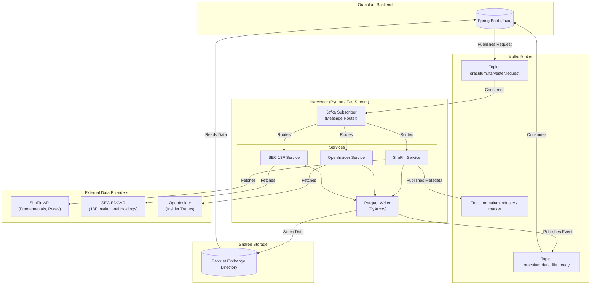

# Oraculum Harvester

Event-driven financial data harvester built with FastStream (Kafka), Python, and the SimFin SDK.

---

## Architecture

The Harvester service runs as an event-driven background worker consuming ingestion requests from Kafka, retrieving datasets from external APIs, writing large datasets locally as Parquet files, and publishing events back to Kafka.



### Ingestion Flow Details

- **Large Datasets** (Companies, Share Prices, Income Statements, Balance Sheets, Cash Flow Statements, Insider Transactions, SEC 13F Holdings):
  Fetched from providers (SimFin, SEC, OpenInsider), written locally to a Parquet file inside the configured exchange directory, and a `DataFileReadyEvent` is published to `oraculum.data_file_ready`.
- **Static Metadata** (Industries, Markets):
  Fetched and published directly to their respective Kafka topics (`oraculum.industry` and `oraculum.market`).

---

## Prerequisites

| Tool          | Purpose                  |
|---------------|--------------------------|
| Python ≥ 3.14 | Runtime environment      |
| `uv`          | Package manager & runner |
| Kafka ≥ 3.x   | Message broker           |

---

## Configuration

Configuration is loaded from `config.yaml` and `.env` (using `envyaml`). Set the following environment variables:

```dotenv
ORACULUM_HARVESTER_SIMFIN_API_KEY=your_simfin_key
ORACULUM_HARVESTER_KAFKA_BROKERS=localhost:9092
ORACULUM_HARVESTER_DATA_DIRECTORY=./data
ORACULUM_HARVESTER_EXCHANGE_DIRECTORY=./exchange
```

*Note: In Docker or production environments, these can be set to absolute paths (such as `/app/data` and `/app/exchange`).*


All defaults in `config.yaml` work for local development without a `.env` file, except `ORACULUM_HARVESTER_SIMFIN_API_KEY` which is always required.

---

## Running the Service

Start the harvester background consumer using `uv`:

```powershell
uv run python -m harvester
```

---

## Triggering Data Ingestion

Ingestion is triggered by sending a request message to the `oraculum.harvester.request` topic.

### Request Payload Structures

Requests are represented as Pydantic models with a required `request_type` discriminator. Below are some examples:

#### 1. Company Metadata Ingestion
```json
{
  "request_type": "fetch_company",
  "correlation_id": "uuid-v4-string",
  "market": "us"
}
```

#### 2. Share Prices Ingestion (Incremental)
```json
{
  "request_type": "fetch_share_price",
  "correlation_id": "uuid-v4-string",
  "market": "us",
  "variant": "daily",
  "from_date": "2026-01-01"
}
```

#### 3. Financial Statements (Income, Balance Sheet, Cash Flow)
```json
{
  "request_type": "fetch_income_statement",
  "correlation_id": "uuid-v4-string",
  "market": "us",
  "template": "general",
  "variant": "quarterly"
}
```
*Note: Valid variants include `annual`, `quarterly`, and `ttm`. Valid templates include `general`, `banks`, and `insurance`.*

#### 4. Markets & Industries
```json
{
  "request_type": "fetch_market",
  "correlation_id": "uuid-v4-string"
}
```
```json
{
  "request_type": "fetch_industry",
  "correlation_id": "uuid-v4-string"
}
```

---

## Development & Code Quality

Maintain codebase standards using the following commands:

```powershell
# Lint and auto-fix issues
uv run ruff check --fix .

# Format code
uv run ruff format .

# Compile-check a file
uv run python -m py_compile path/to/file.py
```