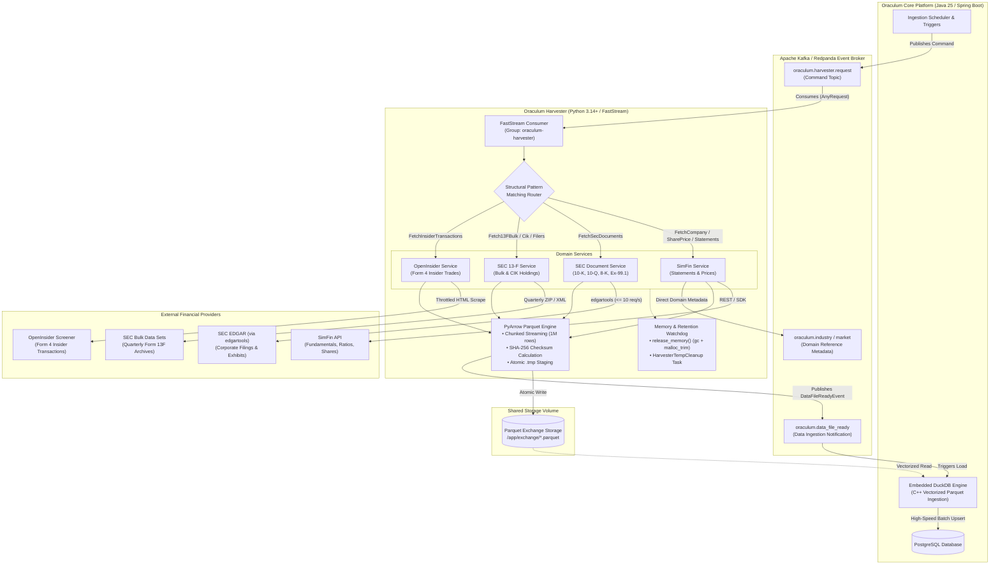

# Oraculum Harvester

<p align="center">
  <strong>High-throughput, event-driven financial data harvesting worker powering the Oraculum analytics platform.</strong><br/>
  Ingests SEC EDGAR corporate filings, Form 13-F institutional portfolios, SimFin fundamental statements, and OpenInsider transactions, serializing high-volume datasets into Apache Parquet for zero-copy DuckDB ingestion.
</p>

<p align="center">
  
  
  
  
  
  
  
  
  
</p>

---

## Table of Contents

- [Overview](#overview)
- [Architecture & Data Pipeline](#architecture--data-pipeline)
  - [Ingestion Flow](#ingestion-flow)
- [Key Technical Highlights](#key-technical-highlights)
- [Provider & Ingestion Matrix](#provider--ingestion-matrix)
- [Command Catalog & JSON Schemas](#command-catalog--json-schemas)
  - [1. Company Fundamentals & Prices](#1-company-fundamentals--prices)
  - [2. SEC EDGAR Document Ingestion](#2-sec-edgar-document-ingestion)
  - [3. SEC Form 13-F Institutional Holdings](#3-sec-form-13-f-institutional-holdings)
  - [4. OpenInsider Transactions](#4-openinsider-transactions)
  - [5. Parquet Ready Completion Event](#5-parquet-ready-completion-event)
- [Configuration Reference](#configuration-reference)
- [Local Development & Execution](#local-development--execution)
- [Container Deployment](#container-deployment)
- [Code Quality & Testing](#code-quality--testing)

---

## Overview

**Oraculum Harvester** is an autonomous, event-driven background ingestion service designed to eliminate batch-processing bottlenecks in financial analytics. Rather than binding heavy HTTP pipelines to the main backend, Harvester operates as an isolated worker on the message bus:

1. Consumes typed command requests from the `oraculum.harvester.request` topic.
2. Interacts with external data providers (**SEC EDGAR**, **SimFin**, **OpenInsider**) respecting strict rate-limits and fair-access policies.
3. Batches, transforms, and serializes multi-million-row financial datasets into Snappy-compressed **Apache Parquet** files in a shared exchange directory.
4. Computes cryptographic SHA-256 checksums and emits `DataFileReadyEvent` notifications to `oraculum.data_file_ready`.
5. Enables the **Oraculum Spring Boot backend** to perform zero-copy, C++ vectorized bulk loading into PostgreSQL via **DuckDB**.

---

## Architecture & Data Pipeline

Harvester integrates seamlessly with Apache Kafka / Redpanda and the Oraculum ecosystem:



### Ingestion Flow

1. **Decoupled Request Scheduling**: The Spring Boot backend schedules or manually triggers an ingestion task by publishing an `AnyRequest` payload with a unique `correlation_id`.
2. **FastStream Async Consumption**: Harvester consumes the command from Kafka. FastStream deserializes the payload using Pydantic v2 discriminated union models based on `request_type`.
3. **Domain Service Dispatch**: A Python 3.14 structural pattern matching statement (`match request: case Fetch...:`) routes the validated request to its corresponding service.
4. **Provider Interaction & Compliance**:
   - **SEC EDGAR**: Uses a dedicated corporate User-Agent (`OraculumHarvester admin@oraculum-analytics.com`) complying with SEC's 10 requests/second policy.
   - **SimFin**: Extracts fundamentals and historical daily share prices with pagination and custom chunking.
   - **OpenInsider**: Scrapes Form 4 transactions with configurable politeness delay (`delaySeconds: 4`).
   - **SEC 13-F**: Downloads quarterly master bulk ZIPs, extracts tab-separated tables (`INFOTABLE.tsv`), and maps CIK institutional ownership.
5. **Columnar Parquet Serialization**: Data is transformed into PyArrow tables and written to `/app/exchange/{correlation_id}_{market}_{dataset}_part-{part}.parquet` using an atomic rename pattern (`.tmp` -> `.parquet`).
6. **Data File Ready Notification**: An event is published to `oraculum.data_file_ready` containing the relative filename, row count, and SHA-256 checksum.
7. **Vectorized Ingestion & Cleanup**: The Java backend reads the Parquet file using DuckDB, verifies checksum integrity, loads rows into PostgreSQL, and the harvester's background loop (`HarvesterTempCleanup`) purges stale staging files according to retention policies.

---

## Key Technical Highlights

- **FastStream Async Messaging**: Purely asynchronous, event-driven microservice powered by `faststream[kafka]` with consumer group load-balancing and auto-offset management.
- **Discriminated Union & Structural Pattern Matching**: Fully typed Pydantic v2 models mapped through Python 3.14 pattern matching (`case FetchCompanyRequest(): ...`), guaranteeing compile-time and runtime validation with zero boilerplate.
- **PyArrow C++ Streaming Engine**: High-performance Parquet generation with configurable chunk sizes (`defaultChunkSize: 1,000,000` rows), minimizing memory footprint during massive historical loads.
- **SEC EDGAR Compliance**: Fully compliant with SEC EDGAR automated access policies, enforcing rate limiting, institutional CIK resolution, and automated retry backoffs.
- **Institutional 13-F Holdings Engine**: Ingestion pipeline for quarterly 13-F filings capable of parsing massive TSV/XML InfoTables for institutional portfolio tracking.
- **Container Hardening & Non-Root Execution**: Multi-stage Docker build with Astral `uv`, non-root execution (`USER 10000:10000`), and minimal attack surface.
- **Active Memory & Disk Lifecycle**: Automatic invoking of `release_memory()` after heavy ingestions and an asynchronous background task (`HarvesterTempCleanup`) that safely expires temporary exchange files.

---

## Provider & Ingestion Matrix

| Data Domain | External Provider | Trigger Command (`request_type`) | Transport / Destination | Output Format |
|---|---|---|---|---|
| **Company Directory** | SimFin | `fetch_company` | `oraculum.data_file_ready` + `/app/exchange` | Apache Parquet |
| **Share Prices (Daily)** | SimFin | `fetch_share_price` | `oraculum.data_file_ready` + `/app/exchange` | Apache Parquet |
| **Income Statements** | SimFin | `fetch_income_statement` | `oraculum.data_file_ready` + `/app/exchange` | Apache Parquet |
| **Balance Sheets** | SimFin | `fetch_balance_sheet` | `oraculum.data_file_ready` + `/app/exchange` | Apache Parquet |
| **Cash Flow Statements** | SimFin | `fetch_cash_flow_statement` | `oraculum.data_file_ready` + `/app/exchange` | Apache Parquet |
| **Market List** | SimFin | `fetch_market` | `oraculum.market` (Kafka direct) | JSON Payload |
| **Industry Taxonomy** | SimFin | `fetch_industry` | `oraculum.industry` (Kafka direct) | JSON Payload |
| **Insider Transactions** | OpenInsider | `fetch_insider_transactions` | `oraculum.data_file_ready` + `/app/exchange` | Apache Parquet |
| **SEC Corporate Filings** | SEC EDGAR (`edgartools`) | `fetch_sec_documents` | `oraculum.data_file_ready` + `/app/exchange` | Apache Parquet |
| **13-F Institutional Bulk** | SEC Structured Data | `fetch_13f_bulk` | `oraculum.data_file_ready` + `/app/exchange` | Apache Parquet |
| **13-F Single CIK** | SEC EDGAR Submissions | `fetch_13f_cik` | `oraculum.data_file_ready` + `/app/exchange` | Apache Parquet |
| **13-F Master Filers** | SEC Master Indexes | `fetch_13f_filers` | `oraculum.data_file_ready` + `/app/exchange` | Apache Parquet |

---

## Command Catalog & JSON Schemas

All ingestion commands published to `oraculum.harvester.request` inherit from the base `Request` schema:

```typescript
interface BaseRequest {
  request_type: string;        // Discriminated union key
  correlation_id: string;      // UUIDv4 for end-to-end tracking
}
```

### 1. Company Fundamentals & Prices

#### Fetch Companies
```json
{
  "request_type": "fetch_company",
  "correlation_id": "9b1deb4d-3b7d-4bad-9bdd-2b0d7b3dcb6d",
  "market": "us"
}
```

#### Fetch Share Prices (Incremental or Full)
```json
{
  "request_type": "fetch_share_price",
  "correlation_id": "4e73b22b-8149-411a-b369-0dfbdc000e31",
  "market": "us",
  "variant": "daily",
  "from_date": "2026-01-01"
}
```

#### Financial Statements (Income, Balance Sheet, Cash Flow)
```json
{
  "request_type": "fetch_income_statement",
  "correlation_id": "f2a36b5c-4389-4d2c-8067-c6b7501a4e10",
  "market": "us",
  "template": "general",
  "variant": "quarterly"
}
```
> *Variants*: `annual`, `quarterly`, `ttm` | *Templates*: `general`, `banks`, `insurance`

---

### 2. SEC EDGAR Document Ingestion

Fetch corporate filings (e.g. 10-K, 10-Q, 8-K, Press Releases / Ex-99.1) for specific target companies:

```json
{
  "request_type": "fetch_sec_documents",
  "correlation_id": "3c84f183-5c02-4753-9a3d-cbb6148eb847",
  "items": [
    {
      "ticker": "AAPL",
      "cik": "0000320193",
      "market": "US",
      "document_types": [
        {
          "document_type": "10-K",
          "last_processed_file_date": "2025-10-01"
        },
        {
          "document_type": "8-K",
          "last_processed_file_date": "2026-02-15"
        }
      ]
    }
  ]
}
```

---

### 3. SEC Form 13-F Institutional Holdings

#### Quarterly 13-F Bulk Archive Ingestion
Downloads the complete SEC quarterly bulk structured ZIP and transforms all institutional holdings into Parquet:

```json
{
  "request_type": "fetch_13f_bulk",
  "correlation_id": "892a6b86-c85c-4f9c-ab49-bc1dc3a84682",
  "year": 2025,
  "quarter": 4
}
```

#### Targeted CIK Real-Time Filing
Ingests the latest 13-F filing for a specific institutional investment manager (e.g. Berkshire Hathaway: `0001067983`):

```json
{
  "request_type": "fetch_13f_cik",
  "correlation_id": "c3bfc1b9-4481-41ef-b7fc-779611e638ad",
  "cik": "0001067983"
}
```

---

### 4. OpenInsider Transactions

Scrapes Form 4 corporate insider purchases, sales, and option exercises:

```json
{
  "request_type": "fetch_insider_transactions",
  "correlation_id": "5b267f75-9b18-494e-b98c-61f16a4ddd8b",
  "market": "us"
}
```

---

### 5. Parquet Ready Completion Event

When data processing completes, Harvester publishes a `DataFileReadyEvent` to `oraculum.data_file_ready`:

```json
{
  "dataset": "sec_13f_holding",
  "file_name": "892a6b86-c85c-4f9c-ab49-bc1dc3a84682_us_sec_13f_holding_part-000.parquet",
  "correlation_id": "892a6b86-c85c-4f9c-ab49-bc1dc3a84682",
  "file_checksum": "a7b3c2d4e5f6...",
  "record_count": 842150
}
```

---

## Configuration Reference

Configuration is driven by `config.yaml` with environment variable overrides via `envyaml`:

| Environment Variable | Default Value | Description |
|---|---|---|
| `ORACULUM_HARVESTER_SIMFIN_API_KEY` | *(Required)* | API key for SimFin fundamental financial data |
| `ORACULUM_HARVESTER_KAFKA_BROKERS` | `localhost:9092` | Kafka / Redpanda broker addresses |
| `ORACULUM_HARVESTER_KAFKA_CONSUMER_GROUP` | `oraculum-harvester` | Kafka consumer group ID |
| `ORACULUM_HARVESTER_KAFKA_TOPIC_HARVESTER_REQUEST` | `oraculum.harvester.request` | Command request queue |
| `ORACULUM_HARVESTER_KAFKA_TOPIC_DATA_FILE_READY` | `oraculum.data_file_ready` | Ingestion completion notification topic |
| `ORACULUM_HARVESTER_KAFKA_TOPIC_MARKET` | `oraculum.market` | Market reference topic |
| `ORACULUM_HARVESTER_KAFKA_TOPIC_INDUSTRY` | `oraculum.industry` | Industry taxonomy reference topic |
| `ORACULUM_HARVESTER_DATA_DIRECTORY` | `/app/data` | Cache directory for SimFin and SEC downloads |
| `ORACULUM_HARVESTER_EXCHANGE_DIRECTORY` | `/app/exchange` | Shared volume for Parquet file generation |
| `ORACULUM_HARVESTER_DEFAULT_CHUNK_SIZE` | `1000000` | Maximum rows per Parquet part partition |
| `ORACULUM_HARVESTER_TEMP_CLEANUP_ENABLED` | `true` | Enables automatic cleanup of stale exchange files |
| `ORACULUM_HARVESTER_TEMP_RETENTION_DAYS` | `1` | Number of days to retain completed Parquet files |
| `ORACULUM_HARVESTER_SEC_USER_AGENT` | `"OraculumHarvester admin@oraculum-analytics.com"` | SEC EDGAR compliant User-Agent (`Name contact@domain`) |
| `ORACULUM_HARVESTER_OPENINSIDER_BASE_URL` | `"http://openinsider.com/screener"` | Base URL for OpenInsider scraper |

---

## Local Development & Execution

### Prerequisites

- **Python ≥ 3.14**
- **Astral `uv`** package manager (`pip install uv` or `curl -LsSf https://astral.sh/uv/install.sh | sh`)
- Running Kafka / Redpanda broker

### Setup & Run

1. **Clone the repository and enter the directory**:
   ```powershell
   cd D:\Git\oraculum-harvestor
   ```

2. **Sync dependencies using `uv`**:
   ```powershell
   uv sync
   ```

3. **Configure environment**:
   Create or edit `.env`:
   ```dotenv
   ORACULUM_HARVESTER_SIMFIN_API_KEY=your_simfin_api_key_here
   ORACULUM_HARVESTER_KAFKA_BROKERS=localhost:9092
   ORACULUM_HARVESTER_DATA_DIRECTORY=./data
   ORACULUM_HARVESTER_EXCHANGE_DIRECTORY=./exchange
   ```

4. **Launch the harvester worker**:
   ```powershell
   uv run python -m harvester
   ```

---

## Container Deployment

The project provides an optimized, multi-stage, non-root `Dockerfile`:

```dockerfile
# Build image
docker build -t oraculum-harvestor:latest .

# Run container with volume mount for Parquet exchange
docker run -d \
  --name oraculum-harvestor \
  -e ORACULUM_HARVESTER_SIMFIN_API_KEY="your_api_key" \
  -e ORACULUM_HARVESTER_KAFKA_BROKERS="redpanda:9092" \
  -v oraculum-exchange:/app/exchange \
  -v oraculum-data:/app/data \
  oraculum-harvestor:latest
```

### Security & Operational Profile

- **Multi-Stage Build**: `builder` installs wheels via Astral `uv` layer-cached cache; final runtime stage uses clean `python:3.14-slim`.
- **Non-Root Execution**: Runs under explicit user `appuser` (`USER 10000:10000`).
- **Stateless & Scalable**: Multiple harvester container replicas can join the `oraculum-harvester` consumer group for parallel partition processing.

---

## Code Quality & Testing

Harvester enforces strict code standards using **Ruff** and **Pytest**:

```powershell
# Lint codebase and automatically fix violations
uv run ruff check --fix .

# Enforce formatting
uv run ruff format .

# Verify python compilation
uv run python -m py_compile harvester/app.py

# Run test suite
uv run pytest
```

---

<p align="center">
  Part of the <strong>Oraculum</strong> financial intelligence platform &bull; Designed for extreme throughput, reliability, and precision.
</p>
